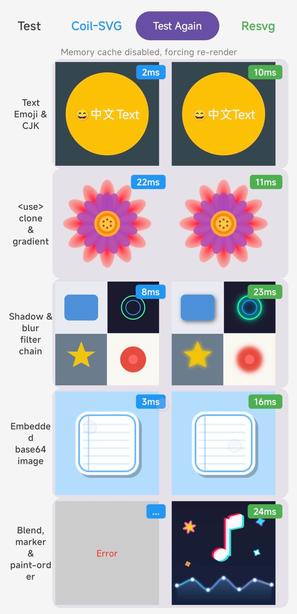
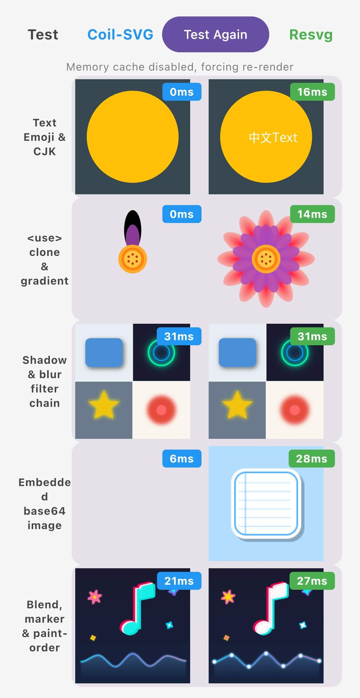

# coil-resvg

A Kotlin Multiplatform SVG decoder for [Coil 3](https://coil-kt.github.io/coil/), powered by [resvg](https://github.com/nickel-org/resvg) (Rust).

Renders SVG images to pixel-perfect bitmaps using the resvg engine via Rust FFI, with text/font support on every platform.

## Screenshot Comparison

| Android | iOS |
|---|---|
|  |  |

## SVG Examples

<details>
  <summary>Click to expand SVG previews</summary>
  <table>
    <tr>
      <td>
        </td>
      <td>
        </td>
    </tr>
    <tr>
      <td>
        </td>
      <td>
        </td>
    </tr>
    <tr>
      <td>
        </td>
      <td></td>
    </tr>
  </table>
</details>

## Supported Platforms

| Platform | Status |
|----------|--------|
| Android  | ✅     |
| iOS      | ✅     |
| JVM (Desktop) | ✅ |
| JS (Browser)  | ✅ |
| Wasm (Browser) | ✅ |

> Note: The JS / Wasm (Browser) targets currently use the browser's native SVG rendering pipeline, not resvg FFI.

## Installation

Add the dependency to your `build.gradle.kts`:

```kotlin
// build.gradle.kts
dependencies {
    implementation("com.hashsequence:coil-resvg:1.0.0")
}
```

For Kotlin Multiplatform projects, add it to `commonMain`:

```kotlin
kotlin {
    sourceSets {
        commonMain.dependencies {
            implementation("com.hashsequence:coil-resvg:1.0.0")
        }
    }
}
```

## Usage

Register `ResvgDecoder` as a component in your Coil `ImageLoader`:

```kotlin
setSingletonImageLoaderFactory { context ->
    ImageLoader.Builder(context)
        .components {
            add(ResvgDecoder.Factory())
        }
        .build()
}
```

Then load SVG images as usual with Coil:

```kotlin
AsyncImage(
    model = "https://example.com/image.svg",
    contentDescription = null,
)
```

That's it — SVG files will be automatically detected and rendered by resvg.

## Why resvg?

- **Pixel-perfect rendering** — resvg is one of the most accurate SVG renderers available, passing the SVG static rendering test suite.
- **Text & font support** — Loads system fonts on each platform (Android/iOS/Desktop).
- **No browser dependency** — Unlike AndroidSVG or WebView-based approaches, resvg is a standalone renderer with zero platform UI dependencies.
- **Consistent cross-platform output** — The same Rust engine runs on all platforms, producing identical rendering results everywhere.

### Fonts: fallback behavior & performance

- Because resvg is platform-independent, its font behavior may be less polished than each platform's native text stack (e.g., weaker fallback selection, and emoji may not render correctly on iOS 26).
- SVGs with text:
  - First render may be slower because it scans the system font database to find usable fonts.
  - Subsequent renders hit a cache and won't rescan system fonts.
- SVGs without text: rendering is not affected by the font scan on first render.

## How It Works

The library uses [resvg](https://github.com/nickel-org/resvg) + [tiny-skia](https://github.com/nickel-org/tiny-skia) compiled as a native Rust library, bridged to Kotlin via [UniFFI](https://mozilla.github.io/uniffi-rs/) and [Gobley](https://github.com/nickel-org/gobley). The SVG is parsed by [usvg](https://github.com/nickel-org/usvg), rendered to RGBA pixels by resvg, and then converted to a platform-native bitmap (e.g., `android.graphics.Bitmap`, `UIImage`, `BufferedImage`).

## License

```
Copyright 2026 HashSequence

Licensed under the Apache License, Version 2.0 (the "License");
you may not use this file except in compliance with the License.
You may obtain a copy of the License at

    http://www.apache.org/licenses/LICENSE-2.0

Unless required by applicable law or agreed to in writing, software
distributed under the License is distributed on an "AS IS" BASIS,
WITHOUT WARRANTIES OR CONDITIONS OF ANY KIND, either express or implied.
See the License for the specific language governing permissions and
limitations under the License.
```
